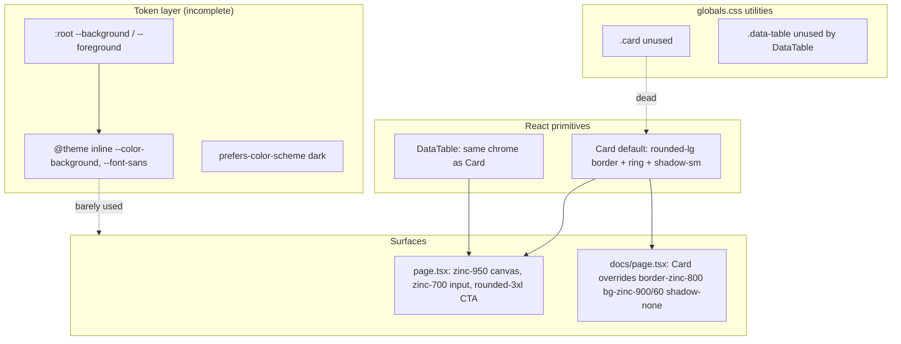
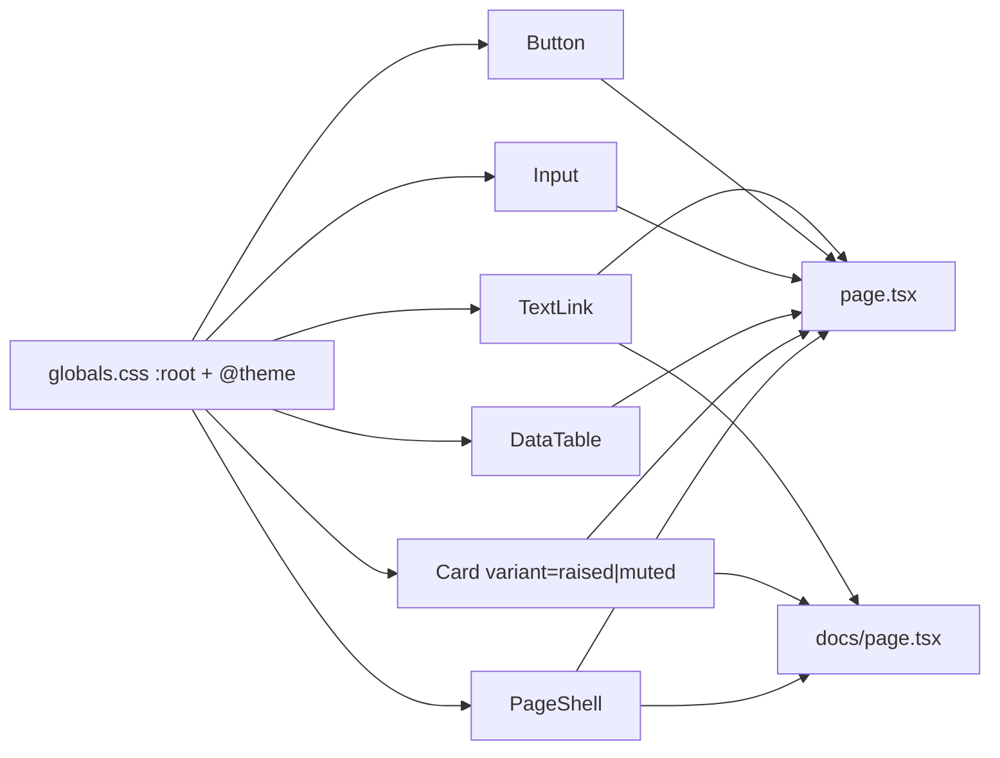

# LongMuch Visual Design System Unification

| Field | Value |
| --- | --- |
| Author | Design / Frontend |
| Date | 2026-09-09 |
| Status | Draft |
| Scope | Frontend visual primitives (tokens, shared components, docs vs homepage vs analyze results) |
| Out of scope | Backend API, metric formulas, routing, data fetching |

---

## Overview

LongMuch (`frontend/`) is a small Next.js 16 App Router surface with three user-facing views: the marketing/search homepage (`app/page.tsx`), the analyze results card + table on that same page, and the docs/primer page (`app/docs/page.tsx`). Visual language is assembled ad hoc from Tailwind v4 utility classes, a thin `Card` / `DataTable` pair, and unused CSS `@apply` duplicates in `app/globals.css`. Theme tokens in `@theme inline` are incomplete and partly broken.

The leading symptom—docs cards using `border-zinc-800` while homepage cards use uncolored `border` plus an inset `ring`—is one instance of a broader problem: **there is no single source of truth for border, radius, shadow, surface color, or type scale**. This document inventories the current inconsistencies with citations, proposes CSS custom properties + `@theme` tokens plus shared primitives, specifies the target border treatment, and lays out incremental PRs.

---

## Background & Motivation

### Current architecture



Stack facts:

- Tailwind **v4** via `@import "tailwindcss"` and `@tailwindcss/postcss` (`frontend/package.json`, `frontend/postcss.config.mjs`). There is **no** `tailwind.config.ts`.
- Fonts: Geist Sans / Geist Mono CSS variables on `<body>` (`app/layout.tsx`).
- Shared components: `app/components/card.tsx`, `data-table.tsx`; barrel `index.ts`.
- `cn()` in `app/utils/cn.ts` is `inputs.filter(Boolean).join(" ")` — **no `tailwind-merge`**, so conflicting utilities (e.g. `bg-background` vs `bg-zinc-900/60`) are not guaranteed to resolve as authors expect.
- `clsx` and `tailwind-merge` appear under `frontend/node_modules` as **transitives only** (not imported in app source; not in `package.json`). PR 1 must declare them as **direct** dependencies. Use **`tailwind-merge` ≥ 3.x** (v4-aware class groups). If `border-edge` / `rounded-card` are treated as unknown, add a one-line `extendTailwindMerge` custom group for `border-color` and `border-radius`.

### Pain points (concrete)

**1. Borders are not one system**

| Surface | Classes | Effective look |
| --- | --- | --- |
| Default `Card` | `border` + `ring-1 ring-inset ring-background/50` | There is **no** `--color-border` in `globals.css`. Unnamed `border` on these `text-white` mains follows **`currentColor` (white, 1px)** — a high-contrast mismatch vs docs — **plus** a second 1px inset ring using `--background` at 50% |
| Docs `Card` override | `border-zinc-800 bg-zinc-900/60 shadow-none hover:shadow-none` | Explicit `#27272a` (zinc-800) 1px border; ring still present from default Card classes because override does not strip `ring-*` |
| Homepage ticker input | `border border-zinc-700` | `#3f3f46` (zinc-700), no ring |
| `DataTable` wrapper | same as default Card | Nested inside homepage `Card` → **double border + double ring + double shadow**, plus stacked padding (`Card` `p-4 sm:p-6` wrapping table `p-3 sm:p-6` and `-mx-1 sm:mx-0`) |
| Table header row | `border-b` | Unnamed `border-b` → **white** `currentColor` on these mains, not zinc-800 |

Zinc scale reference (Tailwind default):

- `zinc-700` = `#3f3f46`
- `zinc-800` = `#27272a`
- `zinc-900` = `#18181b`
- `zinc-950` = `#09090b`

Docs and homepage therefore paint **different gray borders** on the same primitive.

**2. Radius is marketing vs product vs chrome**

- Input / Analyze button: `rounded-2xl sm:rounded-3xl` (16px / 24px).
- `Card` / `DataTable`: `rounded-lg` (8px).
- No `--radius-*` tokens in `@theme`.

**3. Shadows fight the dark canvas**

Default Card: `shadow-sm` hover `shadow-md`. On `bg-zinc-950`, black-tinted shadows are nearly invisible; docs correctly kill them (`shadow-none`) but homepage results keep them. Combined with `ring-inset ring-background/50`, chrome is muddy rather than crisp.

**4. Color tokens vs forced dark pages**

```css
/* app/globals.css */
:root { --background: #ffffff; --foreground: #171717; }
@theme inline {
  --color-background: var(--background);
  --color-foreground: var(--color-foreground); /* circular; does not bind --foreground */
  --font-sans: var(--font-geist-sans);
  --font-mono: var(--font-geist-mono);
}
@media (prefers-color-scheme: dark) {
  :root { --background: #0a0a0a; --foreground: #ededed; }
}
```

Pages ignore this: both mains use `bg-zinc-950 text-white`. `bg-background` on Card therefore resolves to **white in light OS preference** and **#0a0a0a in dark**, sitting on a **always-zinc-950** page. Light-mode OS users see light cards on a near-black page (or washed rings). Product intent is dark-first; tokens still advertise a light default.

**5. Duplicate, unused CSS**

`.card` and `.data-table` in `globals.css` duplicate React component class strings. `DataTable` does not use `.data-table`; table cell styles in CSS (`th` `text-zinc-400`, striped `bg-zinc-950` / `bg-zinc-900`) are reimplemented in TSX. Drift is guaranteed.

**6. Typography scale is per-page**

| Role | Homepage | Docs |
| --- | --- | --- |
| H1 | `text-4xl sm:text-6xl md:text-8xl font-bold tracking-tighter` | `text-3xl sm:text-5xl font-bold tracking-tighter` |
| Subtitle | `text-lg sm:text-2xl md:text-3xl text-zinc-400` | `text-zinc-400 text-base sm:text-lg` |
| Section | n/a | `text-xl sm:text-2xl font-semibold tracking-tight` |
| Body / muted | `text-zinc-500 text-sm sm:text-lg` | `text-zinc-500 text-sm` |
| Mono | unused on home | `font-mono text-sm` on formulas (Geist Mono via `--font-mono`) |

Acceptable that docs H1 is smaller than marketing H1; not acceptable that muted text, link, and heading tokens are copy-pasted rather than named.

**7. Spacing / layout shells differ**

- Home: `max-w-7xl`, `text-center`, `px-4 sm:px-6`, `py-8 sm:py-16`, vertical gaps `mb-8 sm:mb-16`.
- Docs: `max-w-3xl`, `text-left`, `py-10 sm:py-16`, `space-y-4` between cards.
- No shared `PageShell` / `Container`.

**8. Interactive states**

- Input: `focus:outline-none focus:border-white` — no focus ring, 3:1 contrast vs zinc-700 only on focus.
- Button: `hover:bg-zinc-100`, `disabled:opacity-50`, no `focus-visible` ring.
- Links: `underline underline-offset-4 hover:text-zinc-300` at **three** call sites (`page.tsx` ~164; `docs/page.tsx` ~21 and ~92). Color is inherited `text-zinc-500` from the parent; hover is `zinc-300`, not white.
- Cards: hover shadow only; not keyboard-focusable (OK) but docs disable hover inconsistently.

---

## Goals & Non-Goals

### Goals

- One token file (CSS `@theme` in `globals.css`) for color, radius, and border width. Type roles are specified as exact utility strings on existing nodes (no new type engine in v1).
- Shared primitives (`Card`, `DataTable`, `Button`, `Input`, `TextLink`, `PageShell`) consume tokens, not raw zinc hex via one-off utilities.
- Homepage, analyze results, and docs **match** on border width, border color, radius for the same component role.
- Dark-first product: pages and tokens agree; no light cards on dark canvas.
- Incremental PRs; each mergeable without a visual rewrite of all pages at once.
- Preserve existing layout structure and copy; this is unification, not a rebrand.

### Non-Goals

- Light-mode product theme in v1 (keep `prefers-color-scheme` hook only if tokens stay coherent; recommended: force dark `color-scheme: dark` on `<html>`).
- Component library extraction (no shadcn/Radix adoption required).
- Motion redesign, illustration, logo.
- Backend or docs *content* changes (`LOCKED_LABELS`, `metrics-catalog`).
- Pixel-perfect marketing site or design-tool (Figma) source of truth.

---

## Proposed Design

### Source of truth

**CSS custom properties in `app/globals.css`**, mapped into Tailwind v4 via `@theme inline`, consumed by primitives. Pages may use token utilities (`bg-canvas`, `border-edge`, `rounded-card`) but must not invent new zinc borders.

```css
/* Target: app/globals.css — excerpt */
/* :root uses --lm-* names. @theme maps those onto Tailwind theme keys.
   Never assign --radius-card: var(--radius-card) (circular, same class of bug
   as today's --color-foreground: var(--color-foreground)). */

:root {
  color-scheme: dark;

  --lm-canvas: #09090b;           /* zinc-950 — page background */
  --lm-surface: #18181b;          /* zinc-900 — raised panels, inputs */
  --lm-surface-muted: rgb(24 24 27 / 0.6); /* zinc-900/60 — docs cards */
  --lm-foreground: #fafafa;       /* zinc-50 */
  --lm-muted: #a1a1aa;            /* zinc-400 — secondary copy, table headers */
  --lm-muted-2: #71717a;          /* zinc-500 — tertiary copy, link rest */
  --lm-formula: #e4e4e7;          /* zinc-200 — formula strings */
  --lm-edge: #27272a;             /* zinc-800 — default hairline */
  --lm-edge-strong: #3f3f46;      /* zinc-700 — inputs at rest */
  --lm-edge-focus: #fafafa;       /* focus border */
  --lm-accent: #fafafa;           /* primary button bg */
  --lm-accent-fg: #09090b;
  --lm-danger: #f87171;           /* red-400 — analyze error line */

  --lm-radius-card: 0.5rem;       /* 8px — cards */
  --lm-radius-control: 1rem;      /* 16px — Input/Button default (mobile) */
  --lm-radius-control-sm: 1.5rem; /* 24px — Input/Button from sm: */
  --lm-border-width: 1px;

  --lm-shadow-card: none;

  /* Compat: body { background: var(--background) } and leftover bg-background */
  --background: var(--lm-canvas);
  --foreground: var(--lm-foreground);
}

@theme inline {
  --color-canvas: var(--lm-canvas);
  --color-surface: var(--lm-surface);
  --color-surface-muted: var(--lm-surface-muted);
  --color-foreground: var(--lm-foreground);
  --color-muted: var(--lm-muted);
  --color-muted-2: var(--lm-muted-2);
  --color-formula: var(--lm-formula);
  --color-edge: var(--lm-edge);
  --color-edge-strong: var(--lm-edge-strong);
  --color-edge-focus: var(--lm-edge-focus);
  --color-accent: var(--lm-accent);
  --color-accent-fg: var(--lm-accent-fg);
  --color-danger: var(--lm-danger);
  --color-background: var(--lm-canvas);
  --radius-card: var(--lm-radius-card);
  /* Do not map --lm-radius-control* into @theme. That would emit
     rounded-control / rounded-control-sm (single breakpoint). Controls
     must keep rounded-2xl sm:rounded-3xl. --lm-radius-control* on :root
     are documentation only. */
  --default-border-width: var(--lm-border-width);
  --font-sans: var(--font-geist-sans);
  --font-mono: var(--font-geist-mono);
}
```

**Author utilities (type these, do not invent zinc borders):**

| Intent | Class |
| --- | --- |
| Page / shell fill | `bg-canvas` |
| Raised panel | `bg-surface` |
| Docs card fill | `bg-surface-muted` |
| Card / table hairline | `border border-edge` (1px via default width) |
| Input at rest | `border border-edge-strong` |
| Card radius | `rounded-card` |
| Control radius | `rounded-2xl sm:rounded-3xl` only — **do not** use `rounded-control` |
| Secondary text | `text-muted` |
| Tertiary / link rest | `text-muted-2` |
| Formula | `text-formula font-mono text-sm` |
| Error | `text-danger` |

Control radius is **responsive in components**, not a theme utility: `--lm-radius-control` / `--lm-radius-control-sm` on `:root` document 16px / 24px. They are **not** mapped in `@theme`, so `rounded-control` is not generated.

Remove the `prefers-color-scheme` light `:root` block in the same token PR so `--background` cannot snap back to `#ffffff`.

Fix the circular `--color-foreground: var(--color-foreground)` immediately as part of the token PR.

Delete unused `.card` / `.data-table` `@apply` blocks once components own styles, or rewrite them as thin aliases of the same token utilities (prefer **delete** to avoid dual sources).

### Component roles



**Card variants** (one component, no page-level border hacks):

| Variant | Use | Surface | Border | Radius | Shadow |
| --- | --- | --- | --- | --- | --- |
| `muted` (**default**) | Docs primer/metric entries; any Card that does not opt in | `--surface-muted` | 1px `--edge` | `--radius-card` | none |
| `raised` (opt-in) | Homepage analyze results wrapper only | `--surface` | 1px `--edge` | `--radius-card` | none |

No inset ring. `DataTable` **`framed` defaults to `false` always** (not “false when nested”). Homepage Card is the only frame. Pass `framed` only if a standalone table appears later.

**PageShell** (must not un-center the marketing hero):

```tsx
export interface PageShellProps {
  children: React.ReactNode;
  maxWidth?: "wide" | "prose"; // wide = max-w-7xl, prose = max-w-3xl
  /** Vertical + horizontal flex centering of the inner column (homepage). */
  centerViewport?: boolean;
  /** text-center vs text-left on the inner column. Independent of centerViewport. */
  textAlign?: "center" | "start";
  className?: string;
}
```

| Prop combo | Outer `<main>` | Inner column | Matches today |
| --- | --- | --- | --- |
| Home: `maxWidth="wide" centerViewport textAlign="center"` | `min-h-dvh bg-canvas text-foreground flex items-center justify-center overflow-x-hidden` | `w-full max-w-7xl mx-auto px-4 sm:px-6 py-8 sm:py-16 text-center` | `page.tsx` ~99–100 (`py-8`, not `py-10`) |
| Docs: `maxWidth="prose" textAlign="start"` | `min-h-dvh bg-canvas text-foreground overflow-x-hidden` (no flex center) | `w-full max-w-3xl mx-auto px-4 sm:px-6 py-10 sm:py-16 text-left` | `docs/page.tsx` ~16–17 |

`centerViewport` is **flex box centering**, not `text-align`. Home padding stays `py-8 sm:py-16`. Docs padding stays `py-10 sm:py-16`. Do not unify those paddings.

**Input / Button**: class strings in API section. Radius via `rounded-2xl sm:rounded-3xl`. 1px `border-edge-strong` on Input. Focus `border-edge-focus` + `focus-visible:ring-2 focus-visible:ring-edge-focus/40 focus-visible:ring-offset-2 focus-visible:ring-offset-canvas` (do not use `outline-none` without a replacement).

**TextLink**: wraps `next/link`. Rest `text-muted-2`; hover **`hover:text-zinc-300`** (keep current, not `hover:text-foreground`). See Key Decisions.

### Target border treatment (canonical)

This is the decision the rest of the UI must follow.

| Property | Value | Notes |
| --- | --- | --- |
| Width | **1px** (`--lm-border-width` → `--default-border-width`) | Hairline; do not use 2px except focus ring |
| Color (cards, tables, docs) | **`--edge` / `zinc-800` `#27272a`** | Matches current docs intent; slightly softer than input |
| Color (text inputs at rest) | **`--edge-strong` / `zinc-700` `#3f3f46`** | Higher contrast against `--surface` fill |
| Color (hover on controls) | `--edge-focus` at 40% or keep `--edge-strong` | Cards do not hover-border |
| Color (focus) | **`--edge-focus` `#fafafa`** plus **2px ring** `rgb(250 250 250 / 0.4)` with **2px offset** (`ring-offset-2 ring-offset-canvas`) | Keyboard visible; `:focus-visible` only |
| Radius (cards/tables) | **8px** (`rounded-card` / `--lm-radius-card`) | |
| Radius (search + primary CTA) | **16px mobile / 24px sm+** (`rounded-2xl sm:rounded-3xl`) | Tokens `--lm-radius-control` / `--lm-radius-control-sm` document these; components keep the two-class responsive pair |
| Double chrome | **Forbidden** | No `border` + `ring-inset` together; no Card wrapping a bordered DataTable |
| Dark mode | Product **is** dark; `color-scheme: dark` on `html`. Do not fork border colors for light until a real light theme exists | |
| Dividers (table `thead`) | 1px `--edge`, not unnamed `border-b` | |

### Analyze results composition

Today: `Card` (border+ring+shadow, homepage `p-4 sm:p-6`) wraps `DataTable` (border+ring+shadow, `p-3 sm:p-6`, `-mx-1 sm:mx-0`, `min-w-[36rem]`) — two frames **and** stacked padding. Card also has `overflow-hidden`.

Target:

```
Card variant="raised" className="overflow-hidden text-left"
  /* 1px #27272a, 8px radius, bg-surface, p-4 sm:p-6 */
  heading + previous close
  DataTable                          /* framed={false} default */
```

**Unframed DataTable wrapper classes:** `overflow-x-auto` only. **No** `border`, `rounded-*`, `shadow-*`, `bg-*`, **no padding**, **delete `-mx-1 sm:mx-0`**. Inner `<table className="w-full min-w-[36rem] text-sm sm:text-base">` unchanged. `thead tr`: `border-b border-edge`. Stripes: even `bg-canvas`, odd `bg-surface`. Sticky first column uses the **same** stripe color as its row (`bg-canvas` / `bg-surface`) plus `sticky left-0 z-10`.

**`overflow-hidden` on Card vs horizontal scroll:** keep `overflow-hidden` on the results Card for radius clipping. Horizontal scroll lives on the DataTable wrapper (`overflow-x-auto`). Sticky first column is relative to that wrapper, not the Card. Do not put `overflow-hidden` on the table wrapper.

### Typography (v1: exact utilities on existing nodes, no `.type-*` classes)

Do not add `.type-display` / `heading.tsx` in this program. Keep current scale; swap only color tokens where a token exists.

| Node | Keep | Color token |
| --- | --- | --- |
| Home H1 | `text-4xl sm:text-6xl md:text-8xl font-bold tracking-tighter` | inherit `text-foreground` |
| Docs H1 | `text-3xl sm:text-5xl font-bold tracking-tighter` | inherit |
| Home subtitle | `text-lg sm:text-2xl md:text-3xl mb-8 sm:mb-16` | `text-muted` (zinc-400) |
| Docs intro | `text-base sm:text-lg mb-10 sm:mb-12` | `text-muted` |
| Docs H2 | `text-xl sm:text-2xl font-semibold tracking-tight` | inherit |
| Table headers | existing size | `text-muted` |
| Table cells / meaning | existing | `text-zinc-300` (keep; not a token in v1) |
| Formula `dd` | `font-mono text-sm mt-0.5` | `text-formula` |
| Footer / back-link parents | existing size | `text-muted-2` |
| Analyze error `<p role="alert">` | existing | `text-danger` (replaces `text-red-400`) |

**`--muted` vs `--muted-2`:** `--muted` (zinc-400) = secondary readable copy (leads, table headers). `--muted-2` (zinc-500) = tertiary (footers, dt labels, link rest). Do not force docs H1 to `text-8xl`.

### `cn()` upgrade

Replace join-only `cn` with `clsx` + `tailwind-merge` **≥ 3** as **direct** `package.json` dependencies. Required for variant overrides (`border-edge` vs leftover `border`).

---

## API / Interface Changes

### Card (after)

```tsx
export type CardVariant = "raised" | "muted";

export interface CardProps {
  className?: string;
  variant?: CardVariant;
  children: React.ReactNode;
}

const variants: Record<CardVariant, string> = {
  raised:
    "rounded-card border border-edge bg-surface p-4 sm:p-6",
  muted:
    "rounded-card border border-edge bg-surface-muted p-6",
};
```

**Default variant is `muted` (`p-6`)**, matching current default Card padding and docs. Homepage results pass `variant="raised"` (responsive `p-4 sm:p-6`). That way PR 2 can land without shrinking docs padding before PR 3.

Docs: `<Card variant="muted">` — **no** `className="border-zinc-800 ..."`.

Homepage results: `<Card variant="raised" className="overflow-hidden text-left">`.

### DataTable

```tsx
export interface DataTableProps {
  className?: string;
  /** Outer chrome. Default false. Always false unless a future standalone table needs a frame. */
  framed?: boolean;
  headers: string[];
  rows: React.ReactNode[][];
}
```

Default **`framed = false`**. Unframed wrapper: `overflow-x-auto` only (see composition). `framed={true}` (unused today): `rounded-card border border-edge bg-surface overflow-x-auto p-3 sm:p-6`.

### Input

```tsx
export type InputProps = React.ComponentProps<"input">;

const inputClass =
  "w-full sm:flex-1 min-w-0 bg-surface border border-edge-strong rounded-2xl sm:rounded-3xl px-4 sm:px-8 py-3.5 sm:py-5 text-lg sm:text-2xl text-foreground placeholder:text-muted-2 focus:outline-none focus:border-edge-focus focus-visible:ring-2 focus-visible:ring-edge-focus/40 focus-visible:ring-offset-2 focus-visible:ring-offset-canvas";
```

Spread native props (`value`, `onChange`, `onKeyDown`, `placeholder`, `autoCapitalize`, `disabled`, `type` default `"text"`).

### Button

```tsx
export type ButtonProps = React.ComponentProps<"button">;

const buttonClass =
  "w-full sm:w-auto bg-accent hover:bg-zinc-100 text-accent-fg px-6 sm:px-12 py-3.5 sm:py-5 rounded-2xl sm:rounded-3xl font-semibold text-base sm:text-xl transition-all disabled:opacity-50 flex items-center justify-center sm:min-w-[160px] shrink-0 focus-visible:outline-none focus-visible:ring-2 focus-visible:ring-edge-focus/40 focus-visible:ring-offset-2 focus-visible:ring-offset-canvas";
```

Native `type` default `"button"` (homepage search is not a `<form>`). `disabled` passthrough.

### TextLink

```tsx
import Link from "next/link";

export type TextLinkProps = React.ComponentProps<typeof Link>;

const textLinkClass =
  "underline underline-offset-4 text-muted-2 hover:text-zinc-300";
```

Always `next/link` (works for `href="/"` and `href="/docs"`). Homepage currently uses `<a href="/docs">`; switch to `TextLink`.

### PageShell

See Component roles for props and class strings. File: `app/components/page-shell.tsx`.

No REST/API contract changes.

---

## Data Model Changes

None. Visual tokens are CSS only. No persistence, no migrations.

---

## Alternatives Considered

### A. Adopt shadcn/ui (or similar) as the design system

**Pros:** Ready tokens, `cn` + merge, Card/Table/Input/Button, a11y.  
**Cons:** Heavy for two pages; still need to remap colors to zinc dark; dependency and codegen surface larger than the app.  
**Decision:** Reject for now. Revisit if the UI grows past ~10 components.

### B. Page-level class overrides only (status quo plus matching zinc-800 on home)

**Pros:** One-line docs/home border match.  
**Cons:** Ring + nested table borders remain; tokens stay broken; next page repeats the bug.  
**Decision:** Insufficient. The zinc-800/zinc-700 mismatch is the symptom, not the system.

### C. CSS-only `@apply` components, drop React Card

**Pros:** Single CSS file.  
**Cons:** Variants and `framed` table are clumsier; already have React Card.  
**Decision:** Tokens in CSS, composition in React.

### D. True dual theme (light + dark)

**Pros:** Matches existing `:root` light values.  
**Cons:** Product chrome is hardcoded dark zinc; light theme would be a full second pass (table stripes, button inversion, borders).  
**Decision:** Dark-first v1; remove misleading light `:root` or unused media query to prevent `bg-background` flashes.

### E. Minimal chrome fix, no new primitives (one PR)

Strip `ring-*` / `shadow-*` from `Card` and `DataTable`, set `border-zinc-800` on both, fix circular `--color-foreground`, leave join-`cn`, skip PageShell / Button / Input / TextLink.

**Pros:** Fixes the stated docs-vs-home border symptom in one reviewable PR.  
**Cons:** Nested table still double-frames unless padding/`framed` is specified; `focus:outline-none` stays an a11y hole; `bg-background` still fights `bg-zinc-950` for light-OS users; next surface copy-pastes zinc again; `cn` still cannot override variants.  
**Decision:** Reject as the end state. Five PRs beat it because tokens (`--lm-*` vs `@theme`), merge-aware `cn`, unframed table padding, and focus rings are the same work whether or not Button exists—bundling them as named primitives avoids a second unification pass. A **hotfix** of E is allowed only if product needs the border match before PR 1–2 land; it must not close this RFC.

---

## Security & Privacy Considerations

- Visual-only; no new PII, cookies, or analytics.
- Focus rings are an **accessibility** requirement (WCAG 2.4.7). Replacing `focus:outline-none` without a visible indicator is a regression — treat as High severity if shipped.
- `color-scheme: dark` improves native form controls and scrollbars; no privacy impact.
- Do not introduce remote webfonts beyond `next/font` Geist already in `layout.tsx`.

---

## Observability

- No runtime metrics for CSS tokens.
- **Visual regression:** No Playwright/Chromatic in `frontend/package.json` scripts (`@playwright/test` is lockfile-transitive only). `pnpm lint` / `pnpm build` will **not** catch double borders. Gate is a **manual Vercel preview checklist**: (1) home empty, (2) home with a populated table (sticky first column + horizontal scroll on a narrow viewport), (3) docs primer + metrics cards, (4) same three in **light OS `prefers-color-scheme`** to confirm canvas stays dark after PR 1. Optional later: Percy/Chromatic on `/` and `/docs`.
- Alerting: none.

---

## Rollout Plan

- No feature flag needed (CSS is global; keep diffs small per PR).
- Order: tokens + `cn` → Card/DataTable chrome → docs consume variants → homepage controls + shell → delete dead CSS.
- Rollback: revert the single PR. PR 1 aliases `--color-background` / `--background` to canvas so leftover `bg-background` and `body` fill stay defined.
- Staging: Vercel preview per PR; compare `/` and `/docs` side by side.

### Risks

| Risk | Severity | Mitigation |
| --- | --- | --- |
| Tailwind v4 `@theme` self-reference | High | `:root` **only** `--lm-*`; `@theme` maps `--radius-card: var(--lm-radius-card)` etc. Never `--radius-card: var(--radius-card)` |
| `cn` without merge leaves both `border` and `border-edge` | Medium | Direct `tailwind-merge` ≥ 3 in PR 1 |
| Light OS preference vs `bg-background` | High | PR 1 is a **visible dark-token cutover**: `--background` and `--color-background` both canvas; drop light media query; `color-scheme: dark` on `<html>` |
| Body vs `main` after PR 1 | Medium | `body { background: var(--background) }` becomes canvas; mains stay `bg-zinc-950` until PR 4/5 switch to `bg-canvas` (same hex `#09090b`) |
| Nested table still double-framed | Low | `framed` default **false** always |
| Focus ring clipped by Card `overflow-hidden` | Low | Ring on Input/Button only |
| Docs padding shrink if `raised` is default | Medium | Card **default `muted` / `p-6`**; homepage opts into `raised` |

---

## Open Questions

1. Should the search input stay **pill-like** (`rounded-3xl`) while cards stay 8px, or should controls tighten to `rounded-xl` for a more “terminal/data” product? **Recommendation:** keep pill on home CTA only; do not spread to docs.
2. Docs card fill: keep `zinc-900/60` vs solid `--surface`? **Recommendation:** keep muted fill as `variant="muted"` so primer blocks stay quieter than the analyze table.
3. Introduce a real light theme later? Not blocked; tokens are named so light can remap `--canvas` / `--edge`.
4. Add a tiny Storybook / gallery route `/internal/ui`? Optional; probably overkill at two pages.

---

## Key Decisions

1. **CSS custom properties + Tailwind v4 `@theme inline` as the only token source** — the app already uses v4 without `tailwind.config.ts`; do not add a second config file.
2. **`:root` names are `--lm-*`; `@theme` keys never self-reference** — avoids repeating the `--color-foreground` circular bug for radius and colors.
3. **Canonical card border: 1px solid `#27272a` (`zinc-800` / `--lm-edge`), 8px radius, no inset ring, no drop shadow** — aligns docs and analyze chrome; shadows are ineffective on zinc-950.
4. **Control border: 1px `#3f3f46` at rest, `#fafafa` + 2px focus-visible ring** — preserves homepage input contrast while fixing a11y.
5. **Dark-first `color-scheme: dark`; PR 1 is a visible cutover** — set `--background` and `--color-background` to canvas, remove light `prefers-color-scheme`. Body and leftover `bg-background` on Card match `#09090b` immediately; mains’ `bg-zinc-950` is the same hex until they switch to `bg-canvas`.
6. **Card variants (`raised` | `muted`); default is `muted` (`p-6`)** — docs must stop passing `border-zinc-800`; homepage opts into `raised`.
7. **Single frame around analyze results** — Card bordered; DataTable `framed=false` always; unframed means no padding and no `-mx-1`.
8. **Upgrade `cn` to `clsx` + `tailwind-merge` ≥ 3 as direct deps** — required for variant class resolution.
9. **Do not adopt shadcn in this pass** — surface area is two routes; primitives stay local.
10. **Delete unused `.card` / `.data-table` CSS** after components own styles — dual sources caused the original drift.
11. **Marketing display type stays homepage-only** — no `.type-*` engine in v1; swap color tokens only.
12. **PageShell must not un-center the hero** — `centerViewport` keeps `flex items-center justify-center`; home padding stays `py-8 sm:py-16`.
13. **TextLink is `next/link` with `hover:text-zinc-300`** — keep current hover, not `hover:text-foreground`.

---

## References

- `frontend/app/globals.css` — tokens, unused `.card` / `.data-table`
- `frontend/app/layout.tsx` — Geist variables, no `color-scheme`
- `frontend/app/page.tsx` — homepage + analyze results
- `frontend/app/docs/page.tsx` — Card className overrides
- `frontend/app/components/card.tsx` — default chrome
- `frontend/app/components/data-table.tsx` — nested chrome
- `frontend/app/utils/cn.ts` — string join
- `frontend/package.json` — Next 16, Tailwind 4, no clsx/tailwind-merge declared
- Tailwind v4 theme: https://tailwindcss.com/docs/theme

---

## PR Plan

### PR 1 — Design tokens and `cn` merge

- **PR title:** `ui: add dark-first design tokens and tailwind-merge cn`
- **Files/components affected:** `frontend/app/globals.css`, `frontend/app/layout.tsx` (`color-scheme: dark` on `<html>`), `frontend/app/utils/cn.ts`, `frontend/package.json`, lockfile
- **Dependencies:** none
- **Description:** **Visible dark-token cutover**, not a no-op restyle. Define `--lm-*` on `:root` and map them in `@theme inline` (no circular names). Fix `--color-foreground`. Set `--background` and `--color-background` to `--lm-canvas`. Remove light `prefers-color-scheme` block. `color-scheme: dark` on `<html>`. Add **direct** `clsx` + `tailwind-merge` ≥ 3; implement `cn` with them. Pages keep `bg-zinc-950` (same hex as canvas). Card `bg-background` and `body` background **will** change for light-OS users (light card → canvas). Preview checklist: `/` and `/docs` with light OS preference.

### PR 2 — Card and DataTable chrome

- **PR title:** `ui: unify Card/DataTable borders (1px edge, no ring/shadow)`
- **Files/components affected:** `frontend/app/components/card.tsx`, `frontend/app/components/data-table.tsx`, `frontend/app/components/index.ts`
- **Dependencies:** PR 1
- **Description:** Implement Card `variant` with **default `muted` (`p-6`)** so docs padding does not shrink. Remove `ring-*` and shadows. DataTable `framed` **default false always**; unframed = no border/radius/shadow/bg/padding, no `-mx-1`, keep `overflow-x-auto` + `min-w-[36rem]`. Stripes/sticky `bg-canvas` / `bg-surface`; `thead` `border-b border-edge`. Homepage still wraps Card+Table: outer Card still has default `muted` until PR 4 passes `raised` — acceptable (docs-like fill on results) or **ship PR 2+3+homepage `variant="raised"` together**. Independently mergeable if reviewers accept muted results card until PR 4.

### PR 3 — Docs consume Card variants

- **PR title:** `ui: docs cards use Card variant=muted`
- **Files/components affected:** `frontend/app/docs/page.tsx`
- **Dependencies:** PR 2
- **Description:** Replace `className="border-zinc-800 bg-zinc-900/60 text-left shadow-none hover:shadow-none"` with `variant="muted"`. Leave back links as existing `<Link>` classes until PR 4’s `TextLink`. User-visible docs border now matches token `--lm-edge` (same as Card default).

### PR 4 — Homepage shell, input, button

- **PR title:** `ui: homepage uses PageShell, Input, Button tokens`
- **Files/components affected:** `frontend/app/page.tsx`, new `frontend/app/components/page-shell.tsx`, `button.tsx`, `input.tsx`, `text-link.tsx`
- **Dependencies:** PR 1 (tokens); PR 2 if results Card is touched
- **Description:** Add `PageShell`, `Button`, `Input`, `TextLink` with the class strings in API. Home: `PageShell maxWidth="wide" centerViewport textAlign="center"` (preserves flex centering and `py-8 sm:py-16`). Input/Button as specified. Results `Card variant="raised" className="overflow-hidden text-left"`. Footer uses `TextLink`. Error line `text-danger`. Canvas `bg-canvas`.

### PR 5 — Docs PageShell and dead CSS removal

- **PR title:** `ui: share PageShell on docs; remove unused .card CSS`
- **Files/components affected:** `frontend/app/docs/page.tsx`, `frontend/app/globals.css`, `frontend/app/components/index.ts`
- **Dependencies:** PR 3, PR 4 (PageShell)
- **Description:** Wrap docs in `PageShell maxWidth="prose" textAlign="start"` (no `centerViewport`, keep `py-10 sm:py-16`). Switch both back links to `TextLink`. Formula `text-formula`. Delete `.card` / `.data-table` `@apply` blocks. **Review checklist (not `pnpm lint`):** `rg "border-zinc-800|ring-inset" frontend/app` should be empty. No new `.type-*` classes.

Each PR is independently reviewable. PR 1 **does** change Card fill for light-OS users. PR 2 is component API. PR 3–5 are call-site migrations plus cleanup.
